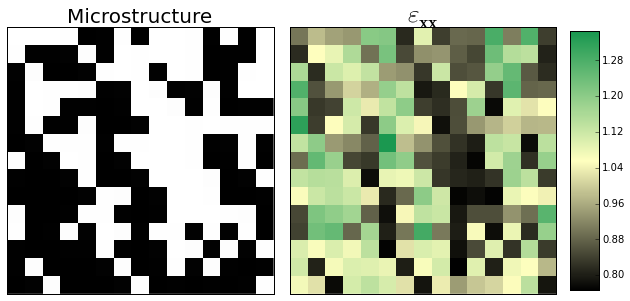
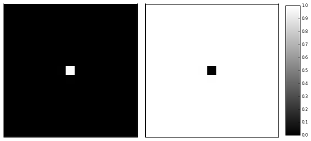
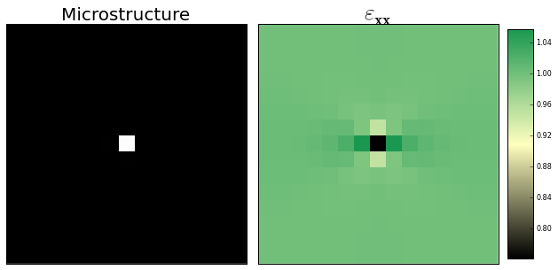
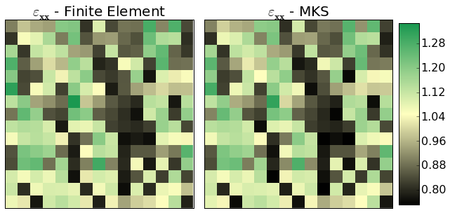

Technical Overview
------------------

An important component of the MKS is the regression technique for rapid
calculation of a response field :math:`p\left[i\right]` based on a
microstructure :math:`m\left[i\right]`, where :math:`i` refers to a
discretized spatial location often in 2D or 3D and
:math:`\left[\cdot\right]` indicates a discrete argument over the
spatial domain. For example, the microstructure might represent values
of material properties that vary based on phase such as elastic modulus
or Poisson's ratio while the response might be the stress or strain
field.

Discretize in State Space
~~~~~~~~~~~~~~~~~~~~~~~~~

The first step in the MKS is to bin (or discretize) the state space. To
do this, the microstructure :math:`\mu` is discretized and then
represented by :math:`m[l, s]` such that

.. math::  \mu \left[s\right] = \sum_{l=0}^{L-1} m\left[l, s\right] l

where :math:`\chi_h` is the basis representation for the microstructure
and :math:`n` is the number of states. For example if
:math:`m \left[i\right] = (0, 2, 1)`, and :math:`n=3`, then
:math:`\chi_h = (0, 1, 2)` and
:math:`m_h[i] = ((1, 0, 0), (0, 0, 1), (0, 1, 0))`. Thus,

.. math::  m_h = \delta_{hm} 

since the :math:`m`'s are just indices representing the state (the
:math:`\left[i\right]` has been dropped).

The Influence Coefficients
~~~~~~~~~~~~~~~~~~~~~~~~~~

Once the state space is discretized, the relationship between the
response :math:`p` and microstructure :math:`m_h` can be written as,

.. math::  p\left[i\right] = \sum_{h=0}^{n-1} \alpha_h\left[j\right] m_h\left[i - j\right] 

where the :math:`\alpha_h` are known as the influence coefficients and
describe the relationship between :math:`p` and :math:`m_h`. The
:math:`p` are a spatial convolution of :math:`\alpha_h` and :math:`m_h`.
In general, it is assumed that both :math:`m_h` and :math:`p` are
periodic.

\*\*\* Note that the formulation above has dropped an index representing
the samples for simplicity. Generally the MKS is calibrated using many
samples. \*\*\*

The Convolution
~~~~~~~~~~~~~~~

The efficiency of the MKS is due to solving the linear regression in
Fourier space. For a 2D problem of size :math:`N^2`, the size of the
regression is reduced from
:math:`\left(N^2 N_{\text{sample}} \times N^2 H \right)` to
:math:`\left(N_{\text{sample}} \times H \right)` for each point in the
Fourier space of size :math:`N^2`. The convolution,

.. math::  \sum_{h=0}^{n-1} \alpha_h\left[j\right] m_h \left[i - j\right] 

can be deconvolved in Fourier space using the `circular convolution
theorem <http://en.wikipedia.org/wiki/Discrete_Fourier_transform#Circular_convolution_theorem_and_cross-correlation_theorem>`__.

If we write
:math:`P \left[k \right] =  \mathcal{F}_k \{ p\left[i\right] \}`,
:math:`M_h \left[k\right]= \mathcal{F}_k  \{ m_h\left[i\right] \}` and
:math:`\beta\left[k\right] = \mathcal{F}_k \{  \alpha_h \left[i\right] \}`,
then we just need to solve

.. math::  P\left[k\right] = \sum_{h=0}^{n-1} \beta_h \left[k\right] M_h \left[k\right] 

with a linear regression at each discretization location in :math:`k` to
calculate the :math:`\beta_h`.

A PyMKS Example
---------------

One important application of the MKS is to accurately and rapidly
reproduce simulations for any given microstructure. In order to do this
we need to instantiate a ``MKSRegressionModel`` and calibrate the
influence coefficients using the ``fit`` method. Once the influence
coefficients have been calibrated, the ``predict`` method can be used to
quickly reproduce the same simulation for any microstructure. The rest
of the page will demonstrate how to do this for a finite element
simulation for linear elastic strain.

Linear Elasticity
-----------------

Let's start by running a finite element simulation on a two phase random
microstructure with different elastic moduli. The
``ElasticFESimulation`` class encapsulates the code needed to run a
plain strain problem using SfePy. It solves a plain strain problem on a
square domain by straining in the x-direction and applying periodic
boundary conditions in the y-direction. The two phase microstructure is
represented by ``X``.

The ``make_elasticFEstrain_random`` function from ``pymks.datasets``
provides a convenient interface to get random microstructures and their
strain fields using the ``ElasticFESimulation`` class. In this case we
are going to look at a 15 by 15 two phase microstructure with values of
elastic modulus values of 80 and 120. Both phases will have a Poisson's
ratio of 0.3.

.. code:: python

    %matplotlib inline
    %load_ext autoreload
    %autoreload 2
    
    import numpy as np
    import matplotlib.pyplot as plt
.. code:: python

    from pymks.tools import draw_microstructure_strain
    from pymks.datasets import make_elastic_FE_strain_random
    
    np.random.seed(21)
    X, strains = make_elastic_FE_strain_random(n_samples=1, elastic_modulus=(80, 120),
                                               poissons_ratio=(0.3, 0.3), size=(15, 15))
    
    draw_microstructure_strain(X[0], strains[0])

Create the Delta Microstructures
~~~~~~~~~~~~~~~~~~~~~~~~~~~~~~~~

The goal of the MKS it to quickly reproduce finite element simulations
like the one shown above. In the case of linear elasticity, which has
distinct phases, the MKS model can be calibrated with two delta
microstructures rather than hundreds of random microstructures. The
``make_delta_microstructures`` function from ``pymks.datasets`` provides
a convenient interface to produce the delta microstructures.

.. code:: python

    from pymks.tools import draw_microstructures
    from pymks.datasets import make_delta_microstructures
    
    X_delta = make_delta_microstructures(n_phases=2, size=(15, 15))
    draw_microstructures(X_delta)

Create the Responses
~~~~~~~~~~~~~~~~~~~~

The ``make_elasticFEstrain_delta`` function from the ``datasets``
submodule of ``pymks`` returns both the delta microstructure and the
strain field. The strain fields and microstructures are used as inputs
to calibrate the influence coefficients.

.. code:: python

    from pymks.datasets import make_elastic_FE_strain_delta
    
    X_delta, strains_delta = make_elastic_FE_strain_delta(elastic_modulus=(80, 120),
                                                          poissons_ratio=(0.3, 0.3),
                                                          size=(15, 15))
    
    draw_microstructure_strain(X_delta[0], strains_delta[0])

Calibrate the MKS Model
~~~~~~~~~~~~~~~~~~~~~~~

The first step is to calibrate the influence coefficients using the
microstructures and strain fields returned by
``make_elasticFEstrain_delta``. The ``MKSRegressionModel`` calibrates
the model in the ``fit`` method. A ``DiscreteIndicatorBasis`` is needed
to discretize the microstructure before passing it to the ``fit``
method.

.. code:: python

    from pymks import MKSRegressionModel
    from pymks.bases import DiscreteIndicatorBasis
    
    basis = DiscreteIndicatorBasis(n_states=2)
    
    X_delta, y_delta = X_delta, strains_delta
    model = MKSRegressionModel(basis=basis)
    model.fit(X_delta, y_delta)
Reproduce the Finite Element Simulation
~~~~~~~~~~~~~~~~~~~~~~~~~~~~~~~~~~~~~~~

Now that the influence coefficients have been calibrated using the
``fit`` method, the original finite element simulation can be reproduced
using the ``MKSRegressionmModel`` by passing the original microstructure
into the ``predict`` method.

.. code:: python

    from pymks.tools import draw_strains_compare
    
    X, y = X, strains
    y_pred = model.predict(X)
    draw_strains_compare(y[0], y_pred[0]);

The ``MKSRegressionModel`` has done quite a good job of predicting the
results from the original FE simulation after calibrating the influence
coefficients using delta microstructures.

Comments
~~~~~~~~

The MKS coefficients can then be scaled up to reproduce larger FE
simulations using only the small FE simulation to seed the MKS model.
